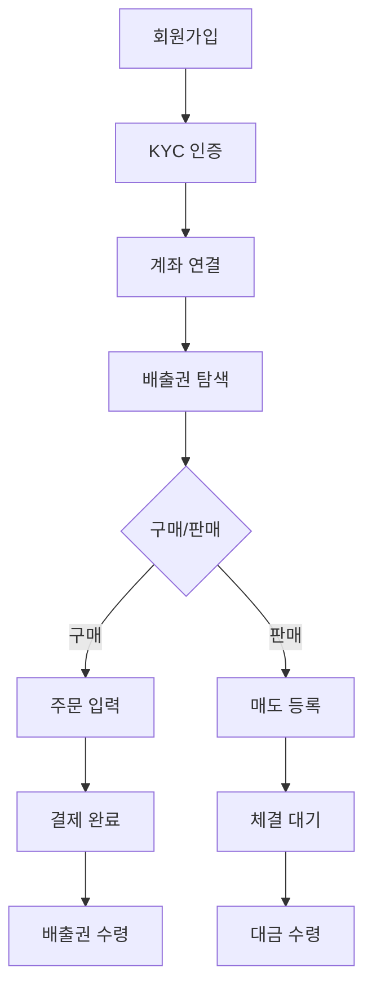

# AI 기능 문서

## 개요

Carbon AI Chatbot은 **멀티 에이전트 AI 시스템**으로, Claude Haiku 4.5를 기반으로 실시간 스트리밍 응답과 다양한 시각화를 제공합니다.

---

## LLM 통합

### 모델 구성

| 에이전트 | 모델 | Temperature | 용도 |
|---------|------|-------------|------|
| **Manager** | Claude Haiku 4.5 | 0.0 | 질문 라우팅 (결정적) |
| **Simple** | Claude Haiku 4.5 | 0.1 | 일반 Q&A (낮은 변동) |
| **Carbon Expert** | Claude Haiku 4.5 | 0.1 | 거래/시장 분석 |
| **Regulation Expert** | Claude Haiku 4.5 | 0.1 | 규제/컴플라이언스 |
| **Support Expert** | Claude Haiku 4.5 | 0.2 | 고객 서비스 |

### 모델 선택 기준

- **Haiku 4.5**: 빠른 응답 속도, 비용 효율적, 충분한 한국어 능력
- 모든 에이전트에 동일 모델 사용하여 일관성 유지
- Temperature 조정으로 응답 특성 제어

---

## 멀티 에이전트 시스템

### 아키텍처

```
사용자 질문
     │
     ▼
┌─────────────────────────────────────────────────────────────┐
│                      전처리 단계                             │
│  ┌──────────┐  ┌──────────┐  ┌──────────┐                  │
│  │ FAQ 캐시 │  │   RAG    │  │ 웹 검색  │  ← 병렬 실행      │
│  │  확인    │  │  검색    │  │  (Tavily)│                  │
│  └──────────┘  └──────────┘  └──────────┘                  │
└─────────────────────────────────────────────────────────────┘
     │
     ▼
┌─────────────────────────────────────────────────────────────┐
│                    Manager Agent                            │
│  - 질문 복잡도 분석 (simple/medium/complex)                  │
│  - 전문가 선택 및 라우팅                                     │
│  - 구조화된 JSON 출력 (tool_choice 강제)                     │
└─────────────────────────────────────────────────────────────┘
     │
     ├── simple ──────> Simple Agent
     │                  (일반 질문, FAQ)
     │
     ├── carbon_expert ──> Carbon Expert
     │                     (배출권 거래)
     │
     ├── regulation_expert ──> Regulation Expert
     │                         (규제 대응)
     │
     └── support_expert ──> Support Expert
                            (고객 상담)
```

### 에이전트별 역할

#### Manager Agent
- **역할**: 질문 분석 및 전문가 라우팅
- **입력**: 사용자 질문 + 대화 컨텍스트
- **출력**: 라우팅 결정 (JSON)
  ```json
  {
    "complexity": "medium",
    "assigned_agent": "carbon_expert",
    "reasoning": "배출권 거래 절차에 대한 전문 지식 필요",
    "confidence": 0.92
  }
  ```

#### Simple Agent
- **역할**: 일반 질문, FAQ, 간단한 정보 제공
- **도구**: RAG 검색, 웹 검색
- **예시 질문**:
  - "NET-Z가 뭔가요?"
  - "회원가입 방법"
  - "영업시간"

#### Carbon Expert
- **역할**: 배출권 거래, 시장 분석
- **도구**: MCP (거래량, 시세, 수수료 계산)
- **예시 질문**:
  - "KOC 현재 시세"
  - "이번 달 거래량"
  - "배출권 매수 방법"

#### Regulation Expert
- **역할**: 규제 대응, 컴플라이언스
- **도구**: MCP (Scope 계산, 리포트)
- **예시 질문**:
  - "Scope 1, 2, 3 차이"
  - "배출량 보고 기한"
  - "온실가스 배출권거래제 대상 기업"

#### Support Expert
- **역할**: 고객 상담, 문제 해결
- **도구**: 고객 분류, 히스토리 조회
- **예시 질문**:
  - "계정 문제 해결"
  - "서비스 이용 문의"
  - "불만 접수"

---

## 실시간 스트리밍

### SSE (Server-Sent Events)

프론트엔드와 백엔드 간 실시간 통신에 SSE를 사용합니다.

```
Client                           Server
  │                                 │
  │ POST /threads/{id}/runs/stream  │
  │ ─────────────────────────────>  │
  │                                 │
  │ event: metadata                 │
  │ <─────────────────────────────  │
  │ {"run_id": "...", "thread_id": "..."}
  │                                 │
  │ event: messages (토큰 1)        │
  │ <─────────────────────────────  │
  │ event: messages (토큰 2)        │
  │ <─────────────────────────────  │
  │ event: messages (토큰 n)        │
  │ <─────────────────────────────  │
  │                                 │
  │ event: values (도구 결과)       │
  │ <─────────────────────────────  │
  │                                 │
  │ event: end                      │
  │ <─────────────────────────────  │
```

### 스트림 모드

```typescript
// 하이브리드 스트리밍
stream.submit(input, {
  streamMode: ["messages", "values"],
  streamSubgraphs: true,
  optimisticValues: (prev) => ({...})
});
```

| 모드 | 설명 | 용도 |
|------|------|------|
| `messages` | 토큰별 실시간 스트리밍 | 텍스트 응답 |
| `values` | 노드 완료 시 전체 상태 | 도구 결과, 메타데이터 |

### 프론트엔드 처리

```typescript
// Stream Provider
const { messages, values, submit, stop } = useStream();

// 메시지 렌더링
{messages.map(msg => (
  msg.type === "ai" ? (
    <AssistantMessage
      message={msg}
      isStreaming={true}
    />
  ) : (
    <HumanMessage message={msg} />
  )
))}
```

---

## 도구 (Tools)

### 범용 도구

모든 에이전트가 사용 가능한 기본 도구입니다.

#### search_knowledge_base
```python
@tool
def search_knowledge_base(query: str) -> str:
    """
    RAG 지식베이스 검색

    Args:
        query: 검색 쿼리

    Returns:
        관련 문서 내용 (최대 3개)
    """
```

#### search
```python
@tool
def search(query: str) -> str:
    """
    Tavily 웹 검색

    Args:
        query: 검색 쿼리

    Returns:
        웹 검색 결과 요약
    """
```

### MCP 도구

NET-Z MCP 서버와 연동되는 전문 도구입니다.

#### Carbon Expert 도구
```python
# 거래량 조회
get_transaction_volume(period: str) -> dict

# 시세 조회
get_market_price(credit_type: str) -> dict

# 배출권 검색
search_carbon_credits(filters: dict) -> list

# 수수료 계산
calculate_trading_fee(amount: int, price: float) -> dict
```

#### Regulation Expert 도구
```python
# Scope 배출량 계산
calculate_scope_emissions(data: dict) -> dict

# 컴플라이언스 리포트
get_compliance_report(company_id: str) -> dict

# 배출 데이터 검증
validate_emission_data(data: dict) -> dict
```

### 도구 호출 흐름

```
에이전트 응답
     │
     ▼
┌─────────────────┐
│ tool_calls 감지 │
└────────┬────────┘
         │
         ▼
┌─────────────────┐
│ 도구 실행       │
│ (call_tools)    │
└────────┬────────┘
         │
         ▼
┌─────────────────┐
│ ToolMessage     │
│ 결과 추가       │
└────────┬────────┘
         │
         ▼
에이전트로 복귀 (결과 포함)
```

---

## 시각화 생성

AI가 자동으로 시각화 코드블록을 생성합니다.

### 차트 (AG Charts)

AI 응답 예시:
```markdown
배출권 거래량을 차트로 보여드리겠습니다.

```agchart
{
  "title": { "text": "월별 배출권 거래량" },
  "series": [{
    "type": "bar",
    "xKey": "month",
    "yKey": "volume",
    "fill": "#4CAF50"
  }],
  "data": [
    { "month": "1월", "volume": 12500 },
    { "month": "2월", "volume": 15800 },
    { "month": "3월", "volume": 18200 }
  ]
}
```
```

### 테이블 (AG Grid)

AI 응답 예시:
```markdown
배출권 종류별 비교표입니다.

```aggrid
{
  "columnDefs": [
    { "field": "type", "headerName": "배출권 종류" },
    { "field": "price", "headerName": "현재가 (원)" },
    { "field": "change", "headerName": "변동률" }
  ],
  "rowData": [
    { "type": "KOC", "price": 15000, "change": "+2.3%" },
    { "type": "KCU", "price": 12000, "change": "-1.5%" }
  ]
}
```
```

### 다이어그램 (Mermaid)

AI 응답 예시:
```markdown
배출권 거래 절차를 다이어그램으로 설명드리겠습니다.


```

### 지도 (Kakao Map)

AI 응답 예시:
```markdown
전국 배출권 거래소 위치입니다.

```map
{
  "center": { "lat": 37.5665, "lng": 126.9780 },
  "zoom": 7,
  "markers": [
    {
      "position": { "lat": 37.5665, "lng": 126.9780 },
      "title": "서울 본사"
    },
    {
      "position": { "lat": 35.1796, "lng": 129.0756 },
      "title": "부산 지사"
    }
  ]
}
```
```

---

## 프롬프트 엔지니어링

### 시스템 프롬프트 구조

```python
SYSTEM_PROMPT = """
당신은 탄소배출권 거래 전문 AI 어시스턴트입니다.

## 역할
- NET-Z 플랫폼 사용자 지원
- 배출권 거래 정보 제공
- 규제 및 컴플라이언스 안내

## 응답 원칙
1. 정확하고 신뢰할 수 있는 정보만 제공
2. 불확실한 경우 명시적으로 표현
3. 출처가 있는 정보는 반드시 인용
4. 한국어로 자연스럽게 응답

## 시각화 가이드
- 수치 데이터: 차트 (agchart) 사용
- 비교 데이터: 테이블 (aggrid) 사용
- 프로세스/절차: 다이어그램 (mermaid) 사용
- 위치 정보: 지도 (map) 사용

## 출처 표기
웹 검색 결과를 인용할 때:
출처:
1. [제목](URL)
2. [제목](URL)
"""
```

### 카테고리별 프롬프트

```python
CATEGORY_PROMPTS = {
    "탄소배출권": """
    배출권 거래 전문가로서 답변합니다.
    - KOC, KCU 등 배출권 종류 설명
    - 거래 절차 및 방법 안내
    - 시장 동향 및 가격 정보 제공
    """,

    "규제대응": """
    규제 컴플라이언스 전문가로서 답변합니다.
    - 온실가스 배출권거래제 설명
    - Scope 1, 2, 3 배출량 계산
    - 보고 의무 및 기한 안내
    """,

    "고객상담": """
    고객 서비스 전문가로서 답변합니다.
    - 친절하고 공감적인 응대
    - 문제 해결 중심 접근
    - 필요시 담당자 연결 안내
    """
}
```

---

## 캐싱 전략

### 3단계 캐싱

```
┌─────────────────────────────────────────────────────────────┐
│ Level 1: FAQ 캐시                                          │
│ - 정확한 문자열 매칭                                        │
│ - 즉시 응답 (LLM 호출 없음)                                 │
│ - TTL: 영구                                                │
└─────────────────────────────────────────────────────────────┘
                              │
                              ▼ MISS
┌─────────────────────────────────────────────────────────────┐
│ Level 2: RAG 캐시                                          │
│ - 벡터 유사도 검색 결과                                     │
│ - TTL: 24시간                                              │
│ - 지식베이스 변경 시 무효화                                  │
└─────────────────────────────────────────────────────────────┘
                              │
                              ▼ MISS
┌─────────────────────────────────────────────────────────────┐
│ Level 3: LLM 응답 캐시                                     │
│ - 질문 해시 기반 매칭                                       │
│ - Storage: Redis (또는 메모리)                              │
│ - TTL: 24시간                                              │
└─────────────────────────────────────────────────────────────┘
```

### 캐시 무효화

```python
def _check_kb_changed(self) -> bool:
    """지식베이스 변경 감지"""
    current_time = self._get_kb_modified_time()
    if current_time > self._kb_last_modified:
        logger.info("지식베이스 변경 감지! 캐시 초기화...")
        cache_manager.clear(prefix="rag")
        cache_manager.clear(prefix="llm")
        return True
    return False
```

---

## 에러 처리

### LLM 오류

```python
try:
    response = await llm.ainvoke(messages)
except RateLimitError:
    # 재시도 로직 (exponential backoff)
    await asyncio.sleep(2 ** retry_count)
except APIError as e:
    # 사용자에게 오류 메시지 전달
    return {"messages": [AIMessage(content="죄송합니다. 일시적인 오류가 발생했습니다.")]}
```

### 도구 오류

```python
try:
    result = tool.invoke(args)
except ToolExecutionError as e:
    # 도구 실패 시 대체 응답
    return ToolMessage(
        content=f"도구 실행 실패: {e}",
        tool_call_id=tool_call.id
    )
```

### 스트리밍 오류

```typescript
// 프론트엔드
stream.on("error", (error) => {
  toast.error("연결이 끊어졌습니다. 다시 시도해주세요.");
  // 자동 재연결 로직
});
```
