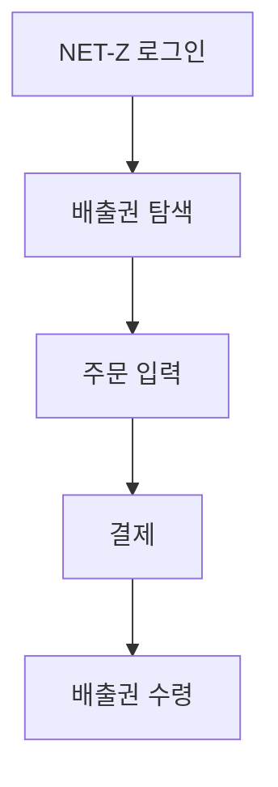

# 백엔드 문서

## 개요

백엔드는 **FastAPI**와 **LangGraph** 기반의 멀티 에이전트 AI 서버입니다. Claude Haiku 4.5를 사용하여 탄소배출권 관련 질문에 답변합니다.

---

## 기술 스택

### 코어 프레임워크

| 패키지 | 버전 | 용도 |
|--------|------|------|
| `fastapi` | Latest | REST API 프레임워크 |
| `uvicorn` | Latest | ASGI 서버 |
| `langgraph` | 0.6.10+ | 에이전트 오케스트레이션 |
| `langchain` | 0.3.27+ | LLM 프레임워크 |
| `langchain-anthropic` | Latest | Claude API 통합 |

### AI/ML

| 패키지 | 용도 |
|--------|------|
| `anthropic` | Claude API 클라이언트 |
| `sentence-transformers` | 임베딩 모델 |
| `chromadb` | 벡터 데이터베이스 |

### 도구 및 유틸리티

| 패키지 | 용도 |
|--------|------|
| `tavily-python` | 웹 검색 API |
| `pypdf` | PDF 파싱 |
| `python-docx` | DOCX 파싱 |
| `redis` | 분산 캐싱 (선택) |

---

## 디렉토리 구조

```
react-agent/
├── src/react_agent/
│   ├── server.py              # FastAPI 서버
│   ├── graph_multi.py         # 멀티에이전트 그래프
│   ├── graph_single.py        # 단일에이전트 (deprecated)
│   ├── graph.py               # 레거시 그래프
│   ├── state.py               # LangGraph 상태
│   ├── configuration.py       # 런타임 설정
│   │
│   ├── agents/
│   │   ├── config.py          # 에이전트 레지스트리
│   │   ├── nodes.py           # 에이전트 노드
│   │   └── prompts.py         # 에이전트 프롬프트
│   │
│   ├── tools.py               # 도구 정의
│   ├── rag_tool.py            # RAG 벡터 검색
│   ├── sse_mcp_client.py      # MCP 클라이언트
│   ├── cache_manager.py       # 캐시 관리자
│   ├── faq_rules.py           # FAQ 데이터베이스
│   ├── utils.py               # 유틸리티
│   ├── geocoding_tool.py      # 지오코딩
│   └── prompts.py             # 시스템 프롬프트
│
├── knowledge_base/            # 지식베이스 문서
│   └── *.pdf, *.docx
│
├── chroma_db/                 # 벡터 DB (자동 생성)
│
├── tests/                     # 테스트
├── pyproject.toml             # Python 프로젝트 설정
├── requirements.txt           # 의존성
├── Dockerfile                 # 컨테이너 이미지
├── langgraph.json             # LangGraph 배포 설정
└── railway.json               # Railway 배포 설정
```

---

## FastAPI 서버

### 서버 구성

**파일**: `src/react_agent/server.py`

```python
app = FastAPI(title="Carbon AI Chatbot")

# CORS 설정
app.add_middleware(
    CORSMiddleware,
    allow_origins=["*"],
    allow_methods=["*"],
    allow_headers=["*"],
)

# 백그라운드 태스크
# - 만료 스레드 정리 (90분)
# - 30분 간격 실행
```

### 엔드포인트

| 메서드 | 경로 | 설명 |
|--------|------|------|
| `GET` | `/ok` | 간단한 헬스체크 |
| `GET` | `/health` | 상세 헬스 상태 |
| `GET` | `/info` | 서버 정보 + 버전 |
| `POST` | `/threads` | 새 스레드 생성 |
| `POST` | `/threads/{id}/runs/stream` | **메인**: SSE 스트리밍 응답 |
| `POST` | `/threads/{id}/runs` | 비스트리밍 응답 |
| `GET` | `/threads/{id}/history` | 대화 히스토리 조회 |
| `POST` | `/threads/{id}/history` | 히스토리 추가 |
| `POST` | `/threads/search` | 스레드 검색 |
| `POST` | `/assistants/search` | 어시스턴트 검색 |
| `GET` | `/categories` | 카테고리 목록 |

### SSE 스트리밍

```python
@app.post("/threads/{thread_id}/runs/stream")
async def stream_run(thread_id: str, request: RunRequest):
    async def generate():
        async for event in graph.astream(
            input_state,
            config={"configurable": {"thread_id": thread_id}},
            stream_mode=["messages", "values"]
        ):
            if "messages" in event:
                yield f"event: messages\ndata: {json.dumps(event)}\n\n"
            elif "values" in event:
                yield f"event: values\ndata: {json.dumps(event)}\n\n"
        yield f"event: end\ndata: {{}}\n\n"

    return StreamingResponse(
        generate(),
        media_type="text/event-stream"
    )
```

---

## LangGraph 에이전트

### 그래프 구조

**파일**: `src/react_agent/graph_multi.py`

```
                    ┌─────────────────┐
                    │    __start__    │
                    └────────┬────────┘
                             │
                             ▼
                    ┌─────────────────┐
                    │ smart_tool_     │
                    │ prefetch        │
                    │ (FAQ, RAG, 검색) │
                    └────────┬────────┘
                             │
              ┌──────────────┴──────────────┐
              │                             │
              ▼                             ▼
     ┌─────────────────┐           ┌─────────────────┐
     │ FAQ 캐시 히트   │           │ manager_agent   │
     │ → 즉시 응답     │           │ (라우팅 결정)    │
     └────────┬────────┘           └────────┬────────┘
              │                             │
              │              ┌──────────────┼──────────────┐
              │              │              │              │
              │              ▼              ▼              ▼
              │     ┌──────────────┐ ┌──────────────┐ ┌──────────────┐
              │     │simple_agent  │ │expert_agent  │ │support_agent │
              │     └──────┬───────┘ └──────┬───────┘ └──────┬───────┘
              │            │                │                │
              │            └────────────────┼────────────────┘
              │                             │
              │                             ▼
              │                    ┌─────────────────┐
              │                    │   call_tools    │
              │                    │  (도구 실행)     │
              │                    └────────┬────────┘
              │                             │
              │                    ┌────────┴────────┐
              │                    │                 │
              │                    ▼                 │
              │           도구 결과 있음      도구 결과 없음
              │                    │                 │
              │                    ▼                 │
              │           에이전트로 복귀     ────────┤
              │                                      │
              └──────────────────────────────────────┤
                                                     │
                                                     ▼
                                            ┌─────────────────┐
                                            │    __end__      │
                                            └─────────────────┘
```

### 상태 정의

**파일**: `src/react_agent/state.py`

```python
@dataclass
class InputState:
    """입력 상태"""
    messages: Annotated[Sequence[AnyMessage], add_messages]

@dataclass
class State(InputState):
    """전체 상태"""
    is_last_step: IsLastStep = False

    conversation_context: dict = field(default_factory=dict)
    # - recent_topics: 최근 3개 토픽
    # - user_type: 사용자 유형
    # - mentioned_entities: 언급된 엔티티
    # - conversation_stage: 대화 단계

    prefetched_context: dict = field(default_factory=dict)
    # - RAG: 지식베이스 검색 결과
    # - MCP_*: MCP 도구 결과
    # - source: 결과 출처

    manager_decision: dict = field(default_factory=dict)
    # - complexity: simple/medium/complex
    # - assigned_agent: 할당된 에이전트
    # - reasoning: 판단 근거
    # - confidence: 신뢰도

    agent_used: str = ""
```

---

## 에이전트 시스템

### 에이전트 레지스트리

**파일**: `src/react_agent/agents/config.py`

```python
class AgentRole(Enum):
    MANAGER = "manager"
    SIMPLE = "simple"
    CARBON_EXPERT = "carbon_expert"
    REGULATION_EXPERT = "regulation_expert"
    SUPPORT_EXPERT = "support_expert"

@dataclass
class AgentConfig:
    role: AgentRole
    name: str
    model: str
    temperature: float
    description: str
    tools: List[str]

AGENT_REGISTRY = {
    AgentRole.MANAGER: AgentConfig(
        role=AgentRole.MANAGER,
        name="Manager",
        model="claude-haiku-4-5",
        temperature=0.0,
        description="질문 분석 및 전문가 라우팅",
        tools=[]
    ),
    AgentRole.SIMPLE: AgentConfig(
        role=AgentRole.SIMPLE,
        name="Simple Agent",
        model="claude-haiku-4-5",
        temperature=0.1,
        description="일반 질문, FAQ",
        tools=["search_knowledge_base", "search"]
    ),
    # ... 다른 에이전트들
}
```

### Manager Agent

**파일**: `src/react_agent/agents/nodes.py`

```python
async def manager_agent(state: State) -> dict:
    """질문 복잡도 분석 및 라우팅"""

    # 1. 질문 분석
    analysis_prompt = f"""
    질문: {state.messages[-1].content}

    분석해주세요:
    1. 복잡도 (simple/medium/complex)
    2. 적합한 전문가
    3. 판단 근거
    """

    # 2. 구조화된 출력 (tool_choice 강제)
    response = await llm.ainvoke(
        messages,
        tool_choice={"type": "function", "function": {"name": "route_decision"}}
    )

    # 3. 라우팅 결정 반환
    return {
        "manager_decision": {
            "complexity": "medium",
            "assigned_agent": "carbon_expert",
            "reasoning": "배출권 거래 관련 전문 질문",
            "confidence": 0.9
        }
    }
```

### Expert Agents

```python
async def expert_agent(state: State) -> dict:
    """전문가 에이전트 (Carbon/Regulation/Support)"""

    # 1. 컨텍스트 구성
    context = state.prefetched_context.get("RAG", "")
    web_results = state.prefetched_context.get("search", "")

    # 2. 프롬프트 구성
    system_prompt = get_expert_prompt(state.manager_decision["assigned_agent"])

    # 3. 도구 사용 및 응답 생성
    response = await llm.ainvoke(
        [SystemMessage(content=system_prompt)] + state.messages,
        tools=get_expert_tools(state.manager_decision["assigned_agent"])
    )

    return {"messages": [response]}
```

---

## 도구 (Tools)

### 범용 도구

**파일**: `src/react_agent/tools.py`

```python
@tool
def search_knowledge_base(query: str) -> str:
    """RAG 지식베이스 검색"""
    return rag_tool.search(query)

@tool
def search(query: str) -> str:
    """Tavily 웹 검색"""
    return tavily_client.search(query)
```

### 전문가 도구 (MCP)

**파일**: `src/react_agent/sse_mcp_client.py`

```python
# Carbon Expert 도구
@tool
def get_transaction_volume(period: str) -> dict:
    """배출권 거래량 조회 (MCP)"""
    return mcp_call("netz.get_transaction_volume", {"period": period})

@tool
def get_market_price(credit_type: str) -> dict:
    """배출권 시세 조회 (MCP)"""
    return mcp_call("netz.get_market_price", {"credit_type": credit_type})

@tool
def calculate_trading_fee(amount: int, price: float) -> dict:
    """거래 수수료 계산 (MCP)"""
    return mcp_call("netz.calculate_trading_fee", {"amount": amount, "price": price})

# Regulation Expert 도구
@tool
def calculate_scope_emissions(data: dict) -> dict:
    """Scope 배출량 계산 (MCP)"""
    return mcp_call("netz.calculate_scope_emissions", data)

@tool
def get_compliance_report(company_id: str) -> dict:
    """컴플라이언스 리포트 조회 (MCP)"""
    return mcp_call("netz.get_compliance_report", {"company_id": company_id})
```

---

## RAG 시스템

### RAG Tool

**파일**: `src/react_agent/rag_tool.py`

```python
class RAGTool:
    """벡터 검색 기반 RAG"""

    def __init__(self):
        # 임베딩 모델: BGE-m3-ko (한국어 특화)
        self.embeddings = HuggingFaceEmbeddings(
            model_name="dragonkue/BGE-m3-ko",
            model_kwargs={"device": "cpu"},
            encode_kwargs={"normalize_embeddings": True}
        )

        # 벡터 스토어: Chroma DB
        self.vectorstore = Chroma(
            persist_directory="./chroma_db",
            embedding_function=self.embeddings
        )

    def load_documents(self, path: str):
        """문서 로드 및 청킹"""
        # 파일 유형별 로더
        loaders = {
            ".pdf": PyPDFLoader,
            ".docx": Docx2txtLoader,
            ".txt": TextLoader,
            ".md": UnstructuredMarkdownLoader
        }

        # 청킹 설정
        splitter = RecursiveCharacterTextSplitter(
            chunk_size=800,
            chunk_overlap=150
        )

        # 문서 처리
        for file in Path(path).glob("*"):
            loader = loaders.get(file.suffix)
            if loader:
                docs = loader(str(file)).load()
                chunks = splitter.split_documents(docs)
                self.vectorstore.add_documents(chunks)

    def search(self, query: str, k: int = 3) -> str:
        """벡터 검색"""
        results = self.vectorstore.similarity_search_with_score(
            query,
            k=k,
            score_threshold=0.7  # 유사도 임계값
        )

        return "\n\n".join([
            f"[Source: {doc.metadata.get('source', 'unknown')}]\n{doc.page_content}"
            for doc, score in results
        ])
```

### 검색 모드

```python
RAG_SEARCH_MODE = os.getenv("RAG_SEARCH_MODE", "vector_only")

# 모드별 동작
- "vector_only": 벡터 유사도 검색만
- "bm25": 키워드 + 벡터 + RRF 융합
- "graph": 벡터 + Neo4j 토픽 확장
```

---

## 캐시 시스템

### Cache Manager

**파일**: `src/react_agent/cache_manager.py`

```python
class CacheManager:
    """3단계 캐시 관리자"""

    def __init__(self):
        self._memory_cache: Dict[str, tuple[Any, datetime]] = {}
        self._redis_client: Optional[redis.Redis] = None

        # Redis 연결 시도
        if os.getenv("USE_REDIS_CACHE") == "true":
            self._redis_client = redis.from_url(os.getenv("REDIS_URL"))

    def get(self, key: str) -> Optional[Any]:
        """캐시 조회"""
        # Level 1: 메모리
        if key in self._memory_cache:
            value, timestamp = self._memory_cache[key]
            if datetime.now() - timestamp < timedelta(hours=24):
                return value

        # Level 2: Redis
        if self._redis_client:
            value = self._redis_client.get(key)
            if value:
                return json.loads(value)

        return None

    def set(self, key: str, value: Any, ttl: int = 86400):
        """캐시 저장"""
        # 메모리 캐시
        self._memory_cache[key] = (value, datetime.now())

        # Redis 캐시
        if self._redis_client:
            self._redis_client.setex(key, ttl, json.dumps(value))

    def clear(self, prefix: str = None):
        """캐시 초기화"""
        if prefix:
            self._memory_cache = {
                k: v for k, v in self._memory_cache.items()
                if not k.startswith(prefix)
            }
        else:
            self._memory_cache.clear()
```

### FAQ 캐시

**파일**: `src/react_agent/faq_rules.py`

```python
FAQ_DATABASE = {
    "배출권 구매 절차": """
## 배출권 구매 절차



1. NET-Z 플랫폼 로그인
2. 원하는 배출권 종류 선택
3. 수량 및 가격 입력
4. 결제 진행
5. 계정으로 배출권 수령
""",

    "koc kcu 차이": """
## KOC vs KCU 비교

| 항목 | KOC | KCU |
|------|-----|-----|
| 발행 | 정부 할당 | 상쇄 프로젝트 |
| 용도 | 배출권거래제 | 상쇄용 |
| 가격 | 높음 | 낮음 |
""",

    # ... 더 많은 FAQ
}

def check_faq(question: str) -> Optional[str]:
    """FAQ 매칭 확인"""
    normalized = normalize(question)
    return FAQ_DATABASE.get(normalized)
```

---

## 세션 관리

### 스레드 정리

```python
async def cleanup_expired_threads():
    """만료된 스레드 정리 (90분)"""
    while True:
        await asyncio.sleep(30 * 60)  # 30분 간격

        current_time = datetime.now()
        expired_threads = []

        for thread_id, checkpoint in checkpointer.storage.items():
            last_activity = checkpoint.metadata.get("timestamp")
            if current_time - last_activity > timedelta(minutes=90):
                expired_threads.append(thread_id)

        for thread_id in expired_threads:
            del checkpointer.storage[thread_id]
            logger.info(f"Cleaned up expired thread: {thread_id}")
```

---

## 실행 방법

### 개발 서버

```bash
cd react-agent
pip install -e .
python -m react_agent.server
```

### Docker

```bash
docker build -t carbon-ai-chatbot .
docker run -p 7860:7860 \
  -e ANTHROPIC_API_KEY=sk-ant-... \
  -e TAVILY_API_KEY=tvly-... \
  carbon-ai-chatbot
```

### 환경변수

```bash
# 필수
ANTHROPIC_API_KEY=sk-ant-...     # Claude API 키
TAVILY_API_KEY=tvly-...          # 웹 검색 API 키

# 선택
HF_TOKEN=hf_...                  # HuggingFace 토큰
USE_REDIS_CACHE=true             # Redis 캐시 사용
REDIS_URL=redis://localhost:6379 # Redis URL
NETZ_MCP_ENABLED=true            # NET-Z MCP 활성화
NETZ_MCP_URL=http://...          # MCP 서버 URL
RAG_SEARCH_MODE=vector_only      # RAG 검색 모드
```
