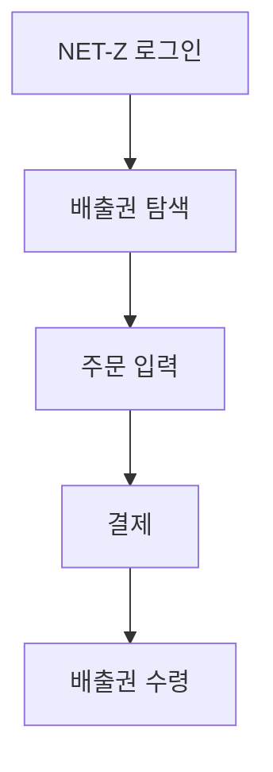

# 데이터베이스 문서

## 개요

Carbon AI Chatbot은 **전통적인 SQL 데이터베이스를 사용하지 않습니다**. 대신 벡터 데이터베이스와 인메모리 저장소를 조합한 AI 네이티브 아키텍처를 채택하고 있습니다.

---

## 저장소 구조

```
┌─────────────────────────────────────────────────────────────┐
│                    데이터 저장소 레이어                       │
├─────────────────────────────────────────────────────────────┤
│                                                             │
│  ┌─────────────┐  ┌─────────────┐  ┌─────────────┐         │
│  │  Chroma DB  │  │ MemorySaver │  │    Redis    │         │
│  │  (벡터)     │  │  (상태)     │  │  (캐시)     │         │
│  └─────────────┘  └─────────────┘  └─────────────┘         │
│        │                │                │                  │
│        ▼                ▼                ▼                  │
│  지식베이스 임베딩   대화 상태/체크포인트   LLM 응답 캐시     │
│                                                             │
└─────────────────────────────────────────────────────────────┘
```

---

## Chroma DB (벡터 데이터베이스)

### 용도
지식베이스 문서의 벡터 임베딩을 저장하고 유사도 검색을 수행합니다.

### 설정

```python
# 저장 경로
CHROMA_DB_PATH = "./chroma_db"

# 임베딩 모델
embedding_model = "dragonkue/BGE-m3-ko"
embedding_dimension = 1024

# 인덱스 설정
index_type = "HNSW"
hnsw_m = 32
hnsw_ef = 100
```

### 스키마

| 필드 | 타입 | 설명 |
|------|------|------|
| `id` | string | 문서 청크 고유 ID |
| `embedding` | float[1024] | BGE-m3-ko 벡터 |
| `document` | string | 원본 텍스트 |
| `metadata` | object | 소스, 페이지 등 메타데이터 |

### 메타데이터 구조

```python
metadata = {
    "source": "knowledge_base/온실가스_배출권거래제.pdf",
    "page": 5,
    "chunk_index": 12,
    "created_at": "2024-01-15T10:30:00Z"
}
```

### 문서 처리 파이프라인

```
원본 문서 (PDF, DOCX, TXT, MD)
        │
        ▼
┌─────────────────┐
│  문서 로드      │  PyPDF, python-docx, pathlib
└────────┬────────┘
         │
         ▼
┌─────────────────┐
│  청킹          │  800자 / 150자 오버랩
└────────┬────────┘
         │
         ▼
┌─────────────────┐
│  컨텍스트 생성  │  Claude Haiku (Contextual Retrieval)
└────────┬────────┘
         │
         ▼
┌─────────────────┐
│  임베딩 생성    │  BGE-m3-ko (1024차원)
└────────┬────────┘
         │
         ▼
┌─────────────────┐
│  Chroma 저장    │  HNSW 인덱스
└─────────────────┘
```

### 검색 쿼리

```python
# 유사도 검색
results = vectorstore.similarity_search_with_score(
    query="배출권 구매 절차",
    k=3,
    score_threshold=0.7
)

# 반환 형식
[
    (Document(content="...", metadata={...}), 0.85),
    (Document(content="...", metadata={...}), 0.78),
    (Document(content="...", metadata={...}), 0.72)
]
```

---

## LangGraph MemorySaver (상태 저장소)

### 용도
대화 스레드와 에이전트 실행 상태를 체크포인트로 저장합니다.

### 구조

```python
from langgraph.checkpoint.memory import MemorySaver

checkpointer = MemorySaver()

# 체크포인트 구조
checkpoint = {
    "thread_id": "uuid-...",
    "checkpoint_id": "uuid-...",
    "parent_checkpoint_id": "uuid-...",
    "metadata": {
        "timestamp": "2024-01-15T10:30:00Z",
        "run_id": "uuid-...",
        "assistant_id": "agent"
    },
    "values": {
        "messages": [...],
        "conversation_context": {...},
        "prefetched_context": {...},
        "manager_decision": {...}
    }
}
```

### 상태 스키마

```python
@dataclass
class State:
    # 메시지 히스토리
    messages: Sequence[BaseMessage]
    # HumanMessage, AIMessage, ToolMessage 시퀀스

    # 대화 컨텍스트
    conversation_context: dict = {
        "recent_topics": ["배출권", "거래", "가격"],
        "user_type": "기업 담당자",
        "mentioned_entities": ["삼성전자", "KOC"],
        "conversation_stage": "ongoing"
    }

    # 전처리 결과
    prefetched_context: dict = {
        "RAG": "관련 문서 내용...",
        "search": "웹 검색 결과...",
        "MCP_market_price": {"KOC": 15000, "KCU": 12000},
        "source": "prefetch"
    }

    # Manager 결정
    manager_decision: dict = {
        "complexity": "medium",
        "assigned_agent": "carbon_expert",
        "reasoning": "배출권 거래 전문 지식 필요",
        "confidence": 0.92
    }

    # 사용된 에이전트
    agent_used: str = "carbon_expert"
```

### 스레드 관리

```python
# 스레드 생성
thread_id = str(uuid.uuid4())
config = {"configurable": {"thread_id": thread_id}}

# 그래프 실행
async for event in graph.astream(input_state, config):
    yield event

# 스레드 조회
state = await graph.aget_state(config)
print(state.values)

# 스레드 목록 (메타데이터 필터링)
threads = checkpointer.list(
    {"metadata": {"assistant_id": "agent"}},
    limit=100
)
```

### 자동 정리

```python
async def cleanup_expired_threads():
    """90분 이상 비활성 스레드 정리"""
    while True:
        await asyncio.sleep(30 * 60)  # 30분 간격

        current = datetime.now()
        for thread_id, checkpoint in checkpointer.storage.items():
            last_activity = checkpoint.metadata.get("timestamp")
            if current - last_activity > timedelta(minutes=90):
                del checkpointer.storage[thread_id]
                logger.info(f"정리됨: {thread_id}")
```

---

## Redis (캐시 저장소)

### 용도
LLM 응답과 RAG 검색 결과를 캐싱하여 응답 속도를 향상시킵니다.

### 설정

```python
# 환경변수
USE_REDIS_CACHE=true
REDIS_URL=redis://localhost:6379/0
CACHE_TTL=86400  # 24시간
```

### 캐시 키 구조

```python
# FAQ 캐시 (영구)
faq:{normalized_question}

# RAG 캐시 (24시간)
rag:{sha256(query)}

# LLM 응답 캐시 (24시간)
llm:{sha256(question + category)}
```

### 캐시 매니저

```python
class CacheManager:
    def __init__(self):
        self._memory_cache: Dict[str, tuple[Any, datetime]] = {}
        self._redis_client: Optional[redis.Redis] = None

        if os.getenv("USE_REDIS_CACHE") == "true":
            try:
                self._redis_client = redis.from_url(
                    os.getenv("REDIS_URL", "redis://localhost:6379/0")
                )
            except Exception as e:
                logger.warning(f"Redis 연결 실패: {e}")

    def get(self, key: str) -> Optional[Any]:
        """캐시 조회 (메모리 → Redis)"""
        # 메모리 캐시 확인
        if key in self._memory_cache:
            value, timestamp = self._memory_cache[key]
            if datetime.now() - timestamp < timedelta(hours=24):
                return value
            del self._memory_cache[key]

        # Redis 캐시 확인
        if self._redis_client:
            try:
                value = self._redis_client.get(key)
                if value:
                    decoded = json.loads(value)
                    # 메모리 캐시에도 저장
                    self._memory_cache[key] = (decoded, datetime.now())
                    return decoded
            except Exception as e:
                logger.warning(f"Redis 조회 실패: {e}")

        return None

    def set(self, key: str, value: Any, ttl: int = 86400):
        """캐시 저장 (메모리 + Redis)"""
        # 메모리 캐시 저장
        self._memory_cache[key] = (value, datetime.now())

        # Redis 캐시 저장
        if self._redis_client:
            try:
                self._redis_client.setex(
                    key,
                    ttl,
                    json.dumps(value, ensure_ascii=False)
                )
            except Exception as e:
                logger.warning(f"Redis 저장 실패: {e}")

    def clear(self, prefix: str = None):
        """캐시 초기화"""
        if prefix:
            # 특정 프리픽스만 삭제
            self._memory_cache = {
                k: v for k, v in self._memory_cache.items()
                if not k.startswith(prefix)
            }
            if self._redis_client:
                for key in self._redis_client.scan_iter(f"{prefix}*"):
                    self._redis_client.delete(key)
        else:
            # 전체 삭제
            self._memory_cache.clear()
            if self._redis_client:
                self._redis_client.flushdb()
```

### 메모리 폴백

Redis가 사용 불가능한 경우 자동으로 인메모리 캐시로 폴백됩니다.

```python
# Redis 연결 실패 시
if not self._redis_client:
    logger.info("메모리 캐시 모드로 동작")
```

---

## FAQ 데이터베이스

### 용도
자주 묻는 질문에 대한 사전 정의된 답변을 저장합니다.

### 구조

```python
# src/react_agent/faq_rules.py

FAQ_DATABASE = {
    "배출권 구매 절차": """
## 배출권 구매 절차



1. NET-Z 플랫폼에 로그인합니다.
2. 원하는 배출권 종류를 선택합니다.
3. 수량과 가격을 입력합니다.
4. 결제를 진행합니다.
5. 계정으로 배출권이 수령됩니다.
""",

    "koc kcu 차이": """
## KOC vs KCU 비교

| 항목 | KOC | KCU |
|------|-----|-----|
| **정식명칭** | Korean Offset Credit | Korean Credit Unit |
| **발행** | 정부 할당 | 상쇄 프로젝트 |
| **용도** | 배출권거래제 이행 | 상쇄용 |
| **가격** | 높음 | 상대적으로 낮음 |
| **거래** | 거래소 | 거래소/장외 |
""",

    "배출권 판매 방법": """
## 배출권 판매 절차

1. **매도 주문 등록**
   - NET-Z 플랫폼에서 매도 희망 가격 설정
   - 판매 수량 입력

2. **체결 대기**
   - 매수 주문과 매칭 대기
   - 시장가/지정가 선택 가능

3. **대금 수령**
   - 체결 완료 시 등록 계좌로 입금
   - 수수료 차감 후 정산
""",

    # ... 더 많은 FAQ
}

def normalize(text: str) -> str:
    """질문 정규화"""
    import re
    text = text.lower()
    text = re.sub(r'[^\w\s]', '', text)
    text = ' '.join(text.split())
    return text

def check_faq(question: str) -> Optional[str]:
    """FAQ 매칭 확인"""
    normalized = normalize(question)
    for key, answer in FAQ_DATABASE.items():
        if normalize(key) == normalized:
            return answer
    return None
```

### FAQ 매칭 흐름

```
사용자 질문
    │
    ▼
┌─────────────────┐
│  정규화         │  소문자 변환, 특수문자 제거
└────────┬────────┘
         │
         ▼
┌─────────────────┐
│  FAQ 검색       │  정확한 문자열 매칭
└────────┬────────┘
         │
    ┌────┴────┐
    │         │
  HIT       MISS
    │         │
    ▼         ▼
즉시 응답   LLM 추론
```

---

## 지식베이스 (파일 시스템)

### 용도
RAG에 사용되는 원본 문서를 저장합니다.

### 디렉토리 구조

```
react-agent/knowledge_base/
├── 온실가스_배출권거래제_해설서.pdf
├── NET-Z_사용자_가이드.pdf
├── 탄소시장_동향_보고서.pdf
├── 규제_컴플라이언스_안내.docx
└── FAQ_모음.txt
```

### 지원 파일 형식

| 형식 | 확장자 | 로더 |
|------|--------|------|
| PDF | `.pdf` | PyPDFLoader |
| Word | `.docx` | Docx2txtLoader |
| 텍스트 | `.txt` | TextLoader |
| 마크다운 | `.md` | UnstructuredMarkdownLoader |

### 핫 리로드

```python
def _check_kb_changed(self) -> bool:
    """지식베이스 파일 변경 감지"""
    current_time = max(
        os.path.getmtime(f)
        for f in Path(self.kb_path).glob("*")
    )

    if current_time > self._kb_last_modified:
        logger.info("지식베이스 변경 감지!")
        # 캐시 무효화
        cache_manager.clear(prefix="rag")
        cache_manager.clear(prefix="llm")
        # 벡터 DB 재구축
        self._rebuild_vectorstore()
        return True

    return False
```

---

## 엔티티 관계도

```
┌─────────────────┐
│     사용자      │
└────────┬────────┘
         │ 질문
         ▼
┌─────────────────┐
│  Thread (스레드) │◄──────────────┐
│  - thread_id    │               │
│  - created_at   │               │
│  - metadata     │               │
└────────┬────────┘               │
         │                        │
         │ 포함                   │ 참조
         ▼                        │
┌─────────────────┐    ┌─────────────────┐
│ Message (메시지) │    │  Checkpoint     │
│ - type          │    │  (체크포인트)    │
│ - content       │    │  - state        │
│ - tool_calls    │    │  - parent_id    │
└────────┬────────┘    └─────────────────┘
         │
         │ 생성
         ▼
┌─────────────────┐
│   Tool Call     │
│ - tool_name     │
│ - args          │
│ - result        │
└────────┬────────┘
         │
         │ 참조
         ▼
┌─────────────────┐    ┌─────────────────┐
│  RAG 검색 결과  │    │   MCP 호출 결과  │
│ (Chroma DB)     │    │  (외부 API)      │
└─────────────────┘    └─────────────────┘
```

---

## 백업 및 복구

### Chroma DB 백업

```bash
# 백업
cp -r ./chroma_db ./chroma_db_backup_$(date +%Y%m%d)

# 복구
rm -rf ./chroma_db
cp -r ./chroma_db_backup_20240115 ./chroma_db
```

### 지식베이스 백업

```bash
# 백업
tar -czvf knowledge_base_backup.tar.gz ./knowledge_base

# 복구
tar -xzvf knowledge_base_backup.tar.gz
```

### Redis 백업

```bash
# RDB 스냅샷
redis-cli BGSAVE

# 복구
# dump.rdb 파일을 Redis 데이터 디렉토리에 복사 후 재시작
```

---

## 성능 최적화

### Chroma DB

```python
# 배치 추가 (대량 문서)
vectorstore.add_documents(
    documents,
    batch_size=100
)

# 검색 최적화
vectorstore.similarity_search(
    query,
    k=3,
    filter={"source": "특정_문서.pdf"}  # 필터링
)
```

### 캐시

```python
# 캐시 워밍업 (서버 시작 시)
async def warmup_cache():
    for question in FAQ_DATABASE.keys():
        cache_manager.set(
            f"faq:{normalize(question)}",
            FAQ_DATABASE[question],
            ttl=None  # 영구
        )
```

### 메모리 관리

```python
# 오래된 스레드 정리
THREAD_TTL_MINUTES = 90

# 캐시 크기 제한
MAX_MEMORY_CACHE_SIZE = 10000
```
