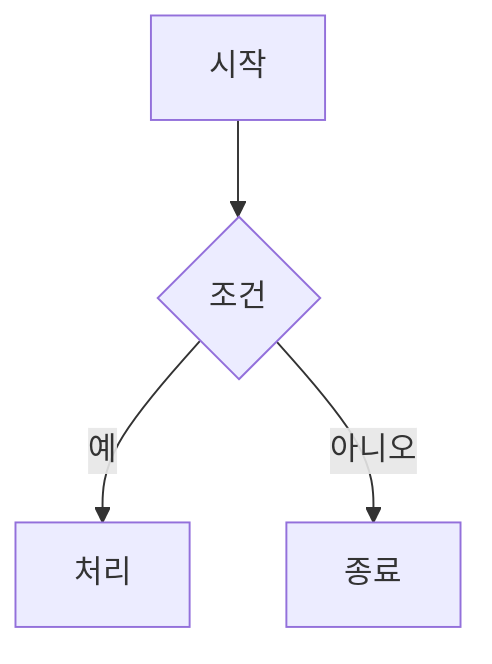

# 프론트엔드 문서

## 개요

프론트엔드는 **Next.js 15**와 **React 19** 기반의 모던 웹 애플리케이션으로, 실시간 AI 채팅 인터페이스를 제공합니다.

---

## 기술 스택

### 코어 프레임워크

| 패키지 | 버전 | 용도 |
|--------|------|------|
| `next` | 15.5.9 | React 프레임워크 |
| `react` | 19.0.0 | UI 라이브러리 |
| `typescript` | ~5.7.2 | 타입 시스템 |
| `tailwindcss` | 4.0.13 | 유틸리티 CSS |

### LangGraph 통합

| 패키지 | 버전 | 용도 |
|--------|------|------|
| `@langchain/langgraph-sdk` | 0.2.63 | 에이전트 SDK |
| `@langchain/core` | 0.3.59 | LangChain 코어 |

### UI 컴포넌트

| 패키지 | 용도 |
|--------|------|
| `@radix-ui/*` | 접근성 기본 컴포넌트 |
| `shadcn/ui` | 스타일된 컴포넌트 |
| `framer-motion` | 애니메이션 |
| `sonner` | 토스트 알림 |

### 시각화 라이브러리

| 패키지 | 버전 | 용도 |
|--------|------|------|
| `ag-charts-react` | 12.0.0 | 데이터 차트 |
| `ag-grid-react` | 35.0.0 | 데이터 테이블 |
| `mermaid` | 11.12.2 | 다이어그램 |
| `leaflet` | 1.9.4 | 지도 (기본) |
| `@deck.gl/*` | 9.2.6 | GPU 가속 지도 |

### 마크다운 렌더링

| 패키지 | 용도 |
|--------|------|
| `react-markdown` | 마크다운 파싱 |
| `remark-gfm` | GitHub Flavored Markdown |
| `remark-math` + `rehype-katex` | LaTeX 수식 |
| `react-syntax-highlighter` | 코드 하이라이팅 |

---

## 디렉토리 구조

```
agent-chat-ui/src/
│
├── app/                           # Next.js App Router
│   ├── page.tsx                   # 메인 페이지
│   ├── layout.tsx                 # 루트 레이아웃
│   ├── ClientApp.tsx              # 클라이언트 컴포넌트 래퍼
│   ├── globals.css                # 전역 스타일
│   ├── api/[..._path]/route.ts    # API 프록시
│   └── map-*/                     # 지도 데모 페이지
│
├── components/
│   ├── ui/                        # Shadcn/UI 기본 컴포넌트
│   │   ├── button.tsx
│   │   ├── dialog.tsx
│   │   ├── input.tsx
│   │   └── ...
│   │
│   ├── thread/                    # 채팅 컴포넌트
│   │   ├── index.tsx              # 메인 채팅 UI
│   │   ├── composer.tsx           # 메시지 입력
│   │   ├── markdown-text.tsx      # 마크다운 렌더링
│   │   ├── ag-chart.tsx           # AG Charts
│   │   ├── ag-grid-table.tsx      # AG Grid
│   │   ├── mermaid-diagram.tsx    # Mermaid 다이어그램
│   │   ├── kakao-map.tsx          # 카카오 지도
│   │   │
│   │   ├── messages/              # 메시지 컴포넌트
│   │   │   ├── ai.tsx             # AI 응답
│   │   │   ├── human.tsx          # 사용자 메시지
│   │   │   └── tool-calls.tsx     # 도구 호출 표시
│   │   │
│   │   ├── history/               # 대화 히스토리
│   │   │   └── index.tsx          # 사이드바
│   │   │
│   │   └── agent-inbox/           # 에이전트 인박스
│   │       ├── index.tsx
│   │       └── types.ts
│   │
│   ├── settings/                  # 설정 컴포넌트
│   │   └── dialog.tsx
│   │
│   └── icons/                     # 커스텀 아이콘
│
├── providers/                     # React Context Providers
│   ├── Stream.tsx                 # SSE 스트리밍
│   ├── Thread.tsx                 # 스레드 관리
│   ├── Session.tsx                # 세션 타임아웃
│   ├── AssistantConfig.tsx        # 어시스턴트 설정
│   ├── Settings.tsx               # UI 설정
│   └── client.ts                  # SDK 클라이언트 팩토리
│
├── hooks/                         # Custom Hooks
│   ├── use-thread-list.ts         # 스레드 목록
│   ├── use-stream.ts              # 스트림 상태
│   └── use-query-state.ts         # URL 쿼리 상태
│
├── lib/                           # 유틸리티
│   ├── config-server.ts           # 서버 설정
│   ├── json-sanitizer.ts          # JSON 정제
│   ├── streaming-markdown-utils.ts # 스트리밍 마크다운
│   └── multimodal-utils.ts        # 파일 변환
│
└── types/                         # TypeScript 타입
    ├── message.ts
    └── thread.ts
```

---

## 핵심 컴포넌트

### Thread (채팅 인터페이스)

**파일**: `src/components/thread/index.tsx`

메인 채팅 UI를 구성하는 컨테이너 컴포넌트입니다.

```tsx
<Thread>
  <ThreadHistory />      {/* 좌측 사이드바: 대화 목록 */}
  <MessageList>          {/* 중앙: 메시지 목록 */}
    <HumanMessage />
    <AssistantMessage />
  </MessageList>
  <Composer />           {/* 하단: 입력창 */}
</Thread>
```

**주요 기능**:
- 카테고리 선택 (탄소배출권/규제대응/고객상담)
- 새 채팅 생성
- 메시지 스트리밍 표시
- 스크롤 자동 추적 (stick-to-bottom)

### AssistantMessage (AI 응답)

**파일**: `src/components/thread/messages/ai.tsx`

AI 응답을 렌더링하는 컴포넌트입니다.

```tsx
<AssistantMessage message={message}>
  <MarkdownText>       {/* 일반 텍스트 */}
  <AGChart>            {/* 차트 코드블록 */}
  <AGGridTable>        {/* 테이블 코드블록 */}
  <MermaidDiagram>     {/* 다이어그램 */}
  <KakaoMap>           {/* 지도 */}
  <ToolCalls>          {/* 도구 호출 내역 */}
</AssistantMessage>
```

**주요 기능**:
- 실시간 토큰 스트리밍
- 시각화 자동 감지 및 렌더링
- 도구 호출 접기/펼치기
- 브랜치 전환

### MarkdownText (마크다운 렌더링)

**파일**: `src/components/thread/markdown-text.tsx`

마크다운을 React 컴포넌트로 변환합니다.

```tsx
<MarkdownText content={markdown}>
  {/* 커스텀 컴포넌트 매핑 */}
  - h1, h2, h3: 스타일된 제목
  - code: 코드블록 (언어별 분기)
    - agchart → <AGChart />
    - aggrid → <AGGridTable />
    - mermaid → <MermaidDiagram />
    - map → <KakaoMap />
    - 기타 → <SyntaxHighlighter />
  - table: 스타일된 테이블
  - a: 외부 링크
</MarkdownText>
```

---

## Providers

### StreamProvider

**파일**: `src/providers/Stream.tsx`

LangGraph SDK의 `useTypedStream` 훅을 래핑합니다.

```tsx
const { stream, submit, stop, values, messages } = useStream();

// 메시지 전송
submit({
  messages: [{ type: "human", content: "질문" }],
  context: { category: "탄소배출권" }
}, {
  streamMode: ["messages", "values"],  // 하이브리드 스트리밍
  streamSubgraphs: true,               // 서브그래프 스트리밍
  optimisticValues: (prev) => {...}    // 낙관적 업데이트
});
```

**스트림 모드**:
- `messages`: 토큰별 실시간 스트리밍
- `values`: 노드 완료 시 전체 상태 업데이트

### ThreadProvider

**파일**: `src/providers/Thread.tsx`

스레드(대화) 상태를 관리합니다.

```tsx
const {
  threads,           // 스레드 목록
  currentThread,     // 현재 스레드
  createThread,      // 새 스레드 생성
  selectThread,      // 스레드 선택
  deleteThread,      // 스레드 삭제
} = useThread();
```

### SessionProvider

**파일**: `src/providers/Session.tsx`

세션 타임아웃(60분)을 관리합니다.

```tsx
// 사용자 활동 감지
- 메시지 전송
- 새 채팅 생성
- UI 상호작용

// 타임아웃 시
- 토스트 알림 표시
- 자동 세션 초기화
```

---

## 시각화 컴포넌트

### AG Charts

**파일**: `src/components/thread/ag-chart.tsx`

AI가 생성한 JSON 설정으로 차트를 렌더링합니다.

```markdown
```agchart
{
  "title": { "text": "배출권 거래량" },
  "series": [{
    "type": "bar",
    "xKey": "month",
    "yKey": "volume"
  }],
  "data": [...]
}
```
```

**지원 차트 유형**:
- Bar (막대), Line (꺾은선), Pie (원형)
- Area (영역), Scatter (산점도)
- 복합 차트

### AG Grid

**파일**: `src/components/thread/ag-grid-table.tsx`

인터랙티브 데이터 테이블을 렌더링합니다.

```markdown
```aggrid
{
  "columnDefs": [
    { "field": "company", "headerName": "기업명" },
    { "field": "emissions", "headerName": "배출량" }
  ],
  "rowData": [...]
}
```
```

**기능**:
- 정렬, 필터링
- 컬럼 리사이즈
- 다크 모드 지원

### Mermaid Diagram

**파일**: `src/components/thread/mermaid-diagram.tsx`

다이어그램을 SVG로 렌더링합니다.

```markdown

```

**지원 다이어그램**:
- Flowchart (순서도)
- Sequence (시퀀스)
- Class (클래스)
- Entity Relationship
- Gantt (간트 차트)

### Kakao Map

**파일**: `src/components/thread/kakao-map.tsx`

카카오 지도 API를 사용한 지도 렌더링입니다.

```markdown
```map
{
  "center": { "lat": 37.5665, "lng": 126.9780 },
  "zoom": 12,
  "markers": [
    {
      "position": { "lat": 37.5665, "lng": 126.9780 },
      "title": "서울시청"
    }
  ]
}
```
```

**기능**:
- 마커 표시
- 지도 스타일 (일반, 위성, 하이브리드)
- 다크 모드 지원

---

## 유틸리티

### JSON Sanitizer

**파일**: `src/lib/json-sanitizer.ts`

AI가 생성한 불완전한 JSON을 정제합니다.

```typescript
// 처리하는 문제들
- 쉼표 형식 숫자 (80,000 → 80000)
- 단일 인용부호 → 이중 인용부호
- 후행 쉼표 제거
- 이스케이프되지 않은 제어 문자
- NaN/Infinity/undefined → null
- 불완전한 JSON 완성 (스트리밍 시)
```

### Streaming Markdown Utils

**파일**: `src/lib/streaming-markdown-utils.ts`

스트리밍 중 불완전한 마크다운을 처리합니다.

```typescript
// 감지하는 패턴
- 닫히지 않은 코드블록
- 불완전한 테이블
- 닫히지 않은 이모지 쌍

// 처리
- 로딩 플레이스홀더 표시
- "차트 생성 중...", "테이블 생성 중..." 레이블
```

### Multimodal Utils

**파일**: `src/lib/multimodal-utils.ts`

파일을 LangChain 콘텐츠 블록으로 변환합니다.

```typescript
// 지원 파일
- 이미지: JPEG, PNG, GIF, WebP
- 문서: PDF

// 변환
fileToContentBlock(file) → {
  type: "image" | "document",
  source: { type: "base64", data: "..." }
}
```

---

## 테마 시스템

### 다크/라이트 모드

`next-themes`를 사용한 테마 전환을 지원합니다.

```tsx
// 설정
<ThemeProvider attribute="class" defaultTheme="system">
  <App />
</ThemeProvider>

// 사용
const { theme, setTheme } = useTheme();
```

### CSS 변수

Tailwind CSS 4와 HSL 색상 변수를 사용합니다.

```css
:root {
  --background: 0 0% 100%;
  --foreground: 240 10% 3.9%;
  --primary: 240 5.9% 10%;
  /* ... */
}

.dark {
  --background: 240 10% 3.9%;
  --foreground: 0 0% 98%;
  /* ... */
}
```

---

## 빌드 및 실행

### 개발 서버

```bash
cd agent-chat-ui
pnpm install
pnpm dev
```

### 프로덕션 빌드

```bash
pnpm build
pnpm start
```

### 환경변수

```bash
# .env.local
NEXT_PUBLIC_API_URL=https://ruffy1601-carbon-ai-chatbot.hf.space
NEXT_PUBLIC_ASSISTANT_ID=agent
```

### Vercel 배포

```bash
vercel
```

`vercel.json` 설정이 포함되어 있어 자동으로 최적화됩니다.
